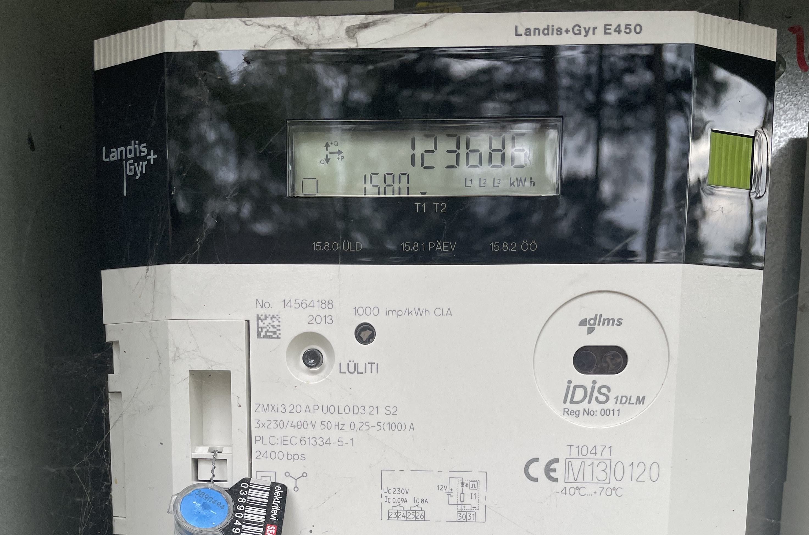
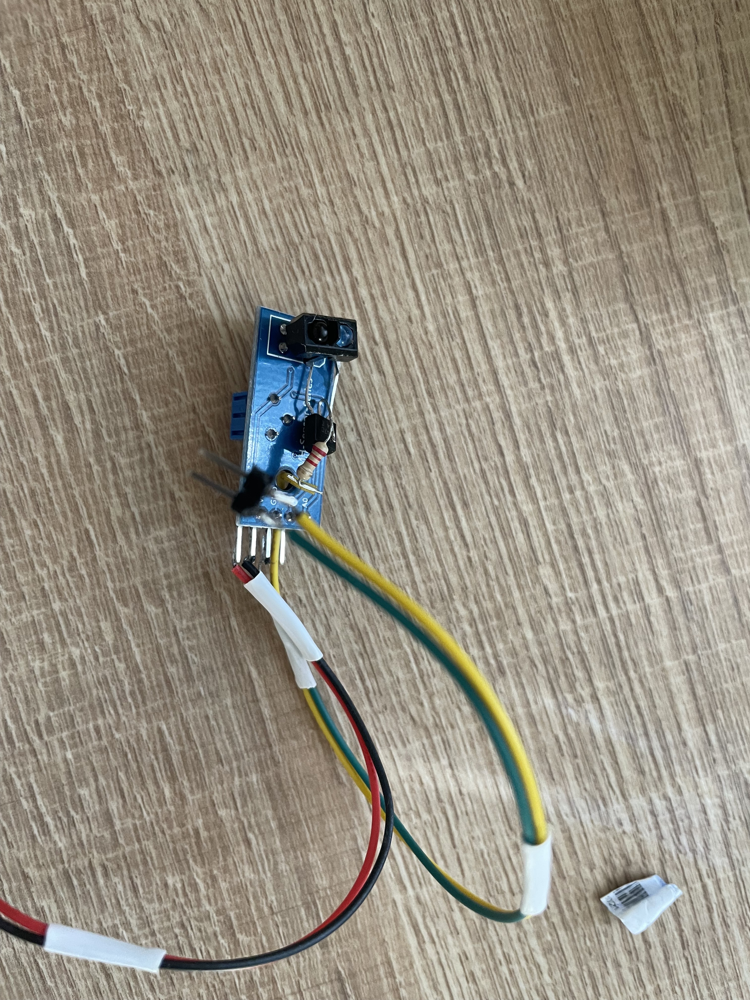

# Electricity Meter
An attempt to use ESP32 to retrieve electricity meter data using local IRDA interface.

Meter: Landis + Gyr 450

Chip: ESP32-U4WDH
Infrared transmitter: slightly modified Aliexpress line follower board based on TCRT5000  

*Result:* No success. Infrared port doesn't respond. Meters Id suggests that there is no "local interface" - "ZMXi 3 20 A P U0 L0 D3". L0 means "no local interface".